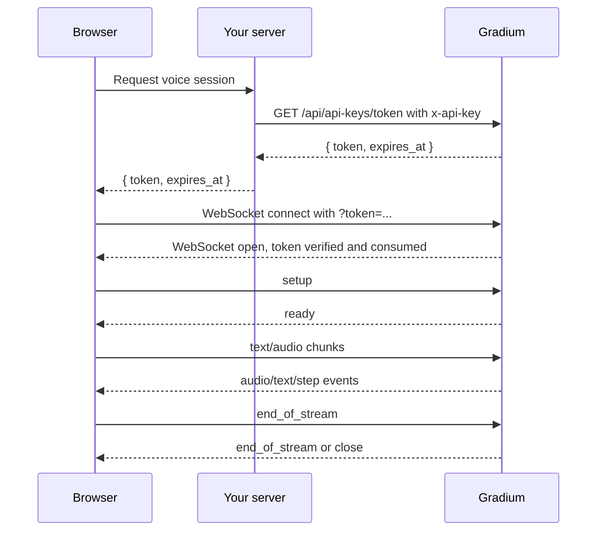

> ## Documentation Index
> Fetch the complete documentation index at: https://docs.gradium.ai/llms.txt
> Use this file to discover all available pages before exploring further.

# Browser WebSockets

> Use short-lived tokens for browser and mobile WebSocket clients without exposing API keys

Do not ship a Gradium API key in browser or mobile code. Browser
bundles can be inspected, and anyone who extracts the key can spend
credits from your account.

Instead, your server should exchange its API key for a short-lived,
single-use Gradium token, then give that token to the authenticated
client. The client connects to the WebSocket endpoint with
`?token=...`.

## Flow



## Generate a Token

Generate the token from trusted server code:

```bash theme={null}
curl -L https://api.gradium.ai/api/api-keys/token \
  -H "x-api-key: $GRADIUM_API_KEY"
```

The response contains the token and its expiration timestamp:

```json theme={null}
{
  "token": "temporary_token",
  "expires_at": "2026-05-23T12:00:00Z"
}
```

The exact lifetime is controlled by the server. Read `expires_at` and
create a fresh token for every new WebSocket connection. A token is
consumed when it is verified, so do not reuse it for reconnects.

## Server Example

```js theme={null}
import express from "express";

const app = express();

app.post("/gradium-token", async (req, res) => {
  // Check your own user session before issuing a token.
  const response = await fetch("https://api.gradium.ai/api/api-keys/token", {
    headers: {"x-api-key": process.env.GRADIUM_API_KEY},
  });

  if (!response.ok) {
    res.status(502).json({error: "Could not create Gradium token"});
    return;
  }

  res.json(await response.json());
});

app.listen(3000);
```

## Browser TTS Example

```js theme={null}
async function createGradiumSocket() {
  const tokenResponse = await fetch("/gradium-token", {method: "POST"});
  if (!tokenResponse.ok) throw new Error("Could not get Gradium token");

  const {token} = await tokenResponse.json();
  const url = new URL("wss://api.gradium.ai/api/speech/tts");
  url.searchParams.set("token", token);

  return new WebSocket(url);
}

const ws = await createGradiumSocket();

ws.addEventListener("open", () => {
  ws.send(JSON.stringify({
    type: "setup",
    voice_id: "YTpq7expH9539ERJ",
    output_format: "pcm",
  }));
  ws.send(JSON.stringify({type: "text", text: "Hello from the browser."}));
  ws.send(JSON.stringify({type: "end_of_stream"}));
});

ws.addEventListener("message", (event) => {
  const msg = JSON.parse(event.data);
  if (msg.type === "audio") {
    const audioBytes = Uint8Array.from(atob(msg.audio), (c) => c.charCodeAt(0));
    console.log("audio chunk", audioBytes.byteLength);
  }
});
```

## Browser STT Notes

For microphone streaming:

* Use `AudioWorklet` or `MediaStreamTrackProcessor` to capture audio.
* Convert audio to 16-bit mono PCM.
* Set `input_format` to the actual sample rate you send, for example
  `pcm_16000`, `pcm_24000`, or `pcm_48000`.
* Send small chunks, around 80-100 ms, for lower latency.

See [Browser microphone to STT](/guides/recipes/browser-microphone-stt)
for an end-to-end skeleton.

## Security Checklist

* Keep `GRADIUM_API_KEY` only on your server.
* Authenticate the user before issuing a token.
* Issue one token per WebSocket connection.
* Do not log tokens in analytics or browser console output.
* If reconnecting, ask your server for a fresh token before opening the
  next socket.

## Next steps

<CardGroup cols={2}>
  <Card title="WebSocket Lifecycle" icon="diagram-project" href="/guides/websocket-lifecycle">
    Setup, ready, input, flush, end, multiplexing, and errors.
  </Card>

  <Card title="Browser microphone to STT" icon="microphone" href="/guides/recipes/browser-microphone-stt">
    Capture microphone audio and stream it to Gradium.
  </Card>
</CardGroup>
